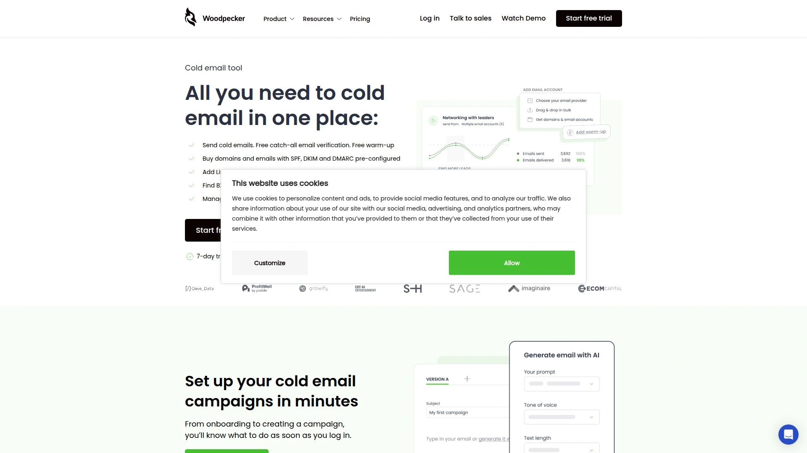
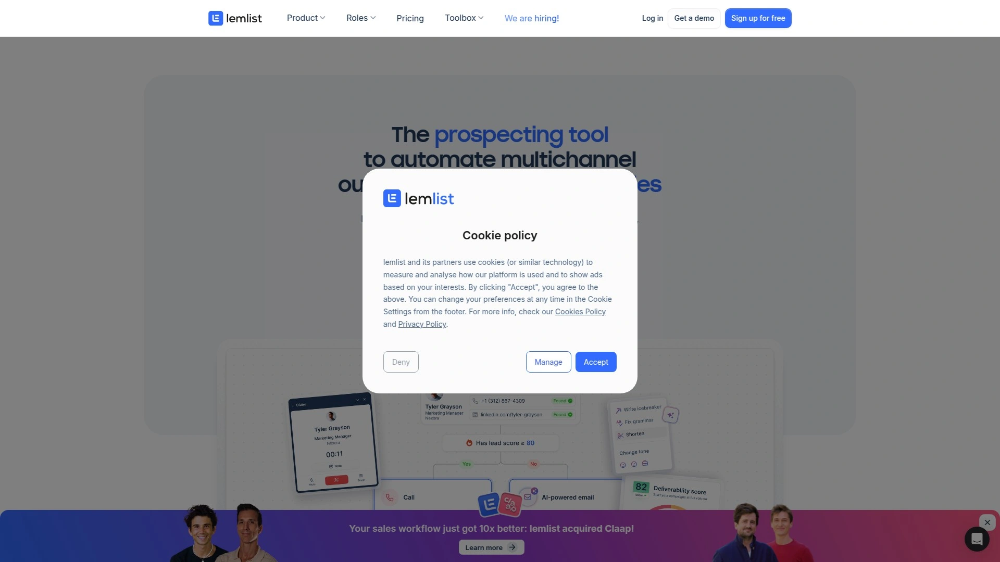
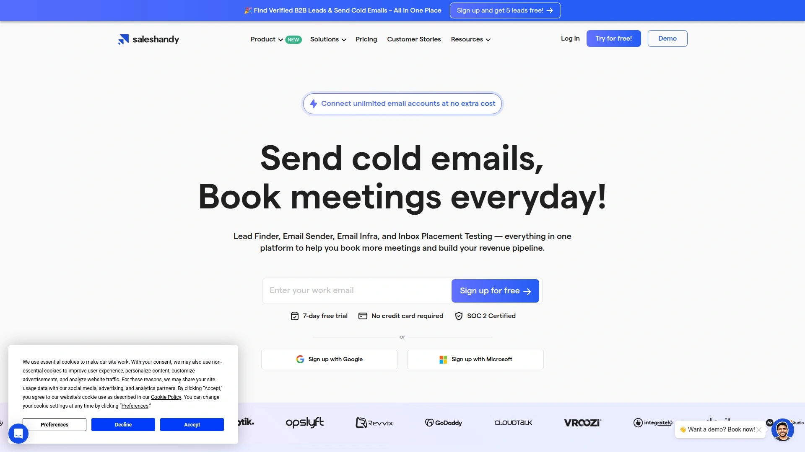
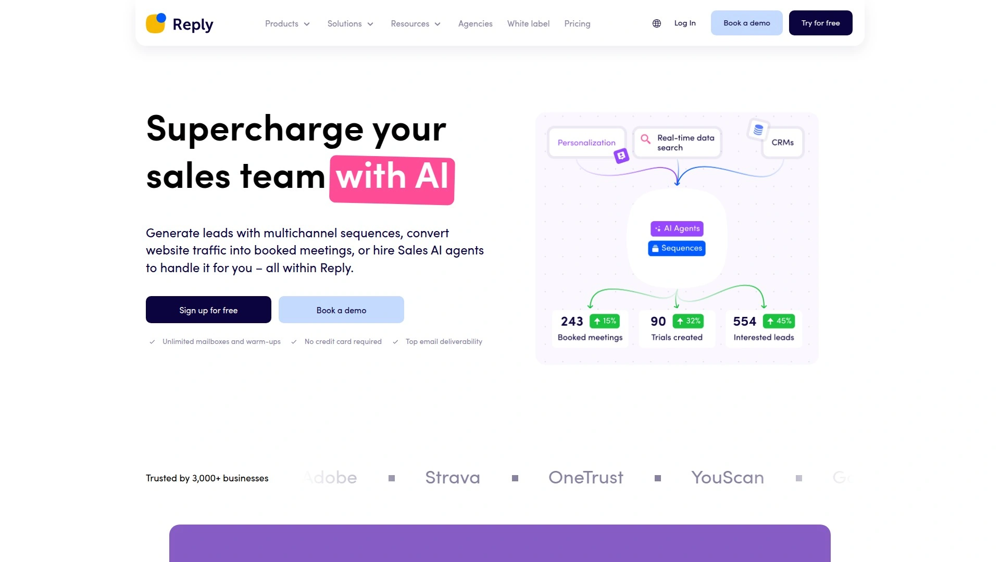
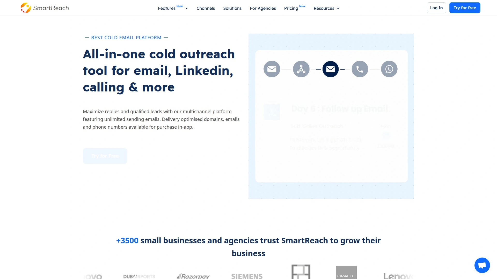
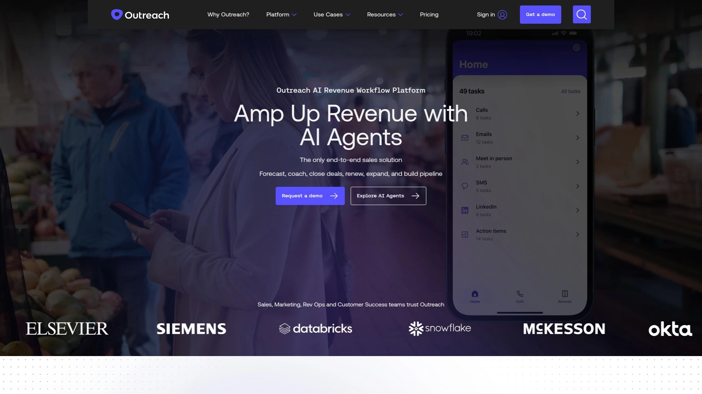
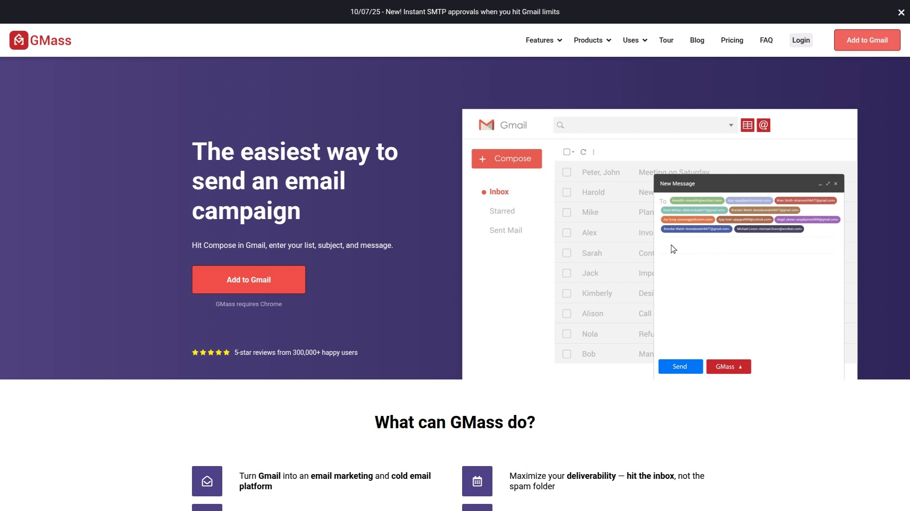

# 2025's Top 8 Best Cold Email Automation Tools

Your sales team manually sends hundreds of follow-up emails weekly, prospects slip through cracks because someone forgot to follow up, and tracking who opened what becomes an impossible spreadsheet nightmare. Traditional email campaigns require copying, pasting, and remembering to send follow-ups at the right times—tasks that consume hours while delivering inconsistent results and burned-out team members. Cold email automation platforms eliminate this manual chaos by scheduling personalized sequences, tracking engagement metrics, and automatically pausing campaigns when prospects reply. Whether you're a sales team scaling outreach, a recruitment agency connecting with candidates, or a startup generating leads on limited resources, modern cold email tools deliver higher response rates through better timing, personalization, and persistent follow-ups that humans simply cannot maintain manually.

## **[Woodpecker](https://woodpecker.co)**

Human-like sending with email throttling algorithms protecting sender reputation automatically.

Woodpecker automates cold email campaigns and follow-ups eliminating manual typing, copy-pasting, and remembering to send messages at optimal times. The platform spaces emails intelligently—sending one every few minutes rather than blasting hundreds simultaneously—keeping email providers from flagging accounts while maintaining natural sending patterns through irregular frequency algorithms that mimic human behavior avoiding spam filters. Integration with Gmail, Outlook, and any IMAP email completes in seconds, allowing teams to use multiple addresses with alias support perfect for large teams reaching prospects through different sender identities. Follow-up automation continues within the same email thread providing full context even when prospects didn't open initial messages, while automatic response detection pauses sequences immediately upon replies preventing awkward follow-ups after conversations start. The campaign builder allows creating up to seven follow-ups with customizable time intervals between messages—your second email sends three days after the first if prospects don't respond, or whatever schedule you configure. Personalization features including custom fields and snippets merge contact information from your database into templates making mass emails feel unique and personal to each recipient, with CSV import capability enabling quick personalization at scale. Security emphasis includes automatic duplicate elimination regardless of import method, blacklisting prospects who report spam ensuring you never email them again, and email throttling protecting domain reputation. Campaign scheduling sets delivery times within chosen time zones ensuring messages arrive when prospects actively check email rather than overnight. Analytics track opens, clicks, sends, deliveries, and response categorization (interested, maybe later, uninterested) helping identify which templates, subject lines, and links generate best results for optimization. Lead Finder tool helps discover new prospects though bulk selection limits to 25-50 contacts at a time may challenge teams scaling quickly. LinkedIn outreach integrates via third-party Dux-Soup connection adding multi-channel capability though lacking native LinkedIn automation. Free trial contacts up to 50 prospects testing full functionality before commitment. Best suited for sales teams prioritizing deliverability and sender reputation protection, agencies managing multiple client outreach campaigns, and businesses wanting simple setup without technical complexity. The focus on human-like sending patterns and automatic spam protection distinguishes Woodpecker from tools prioritizing volume over inbox placement.

## **[Lemlist](https://www.lemlist.com)**

Multichannel outreach combining email, LinkedIn, and phone in unified sequences.

Lemlist pioneered cold email personalization through dynamic image and video customization making outreach visually distinctive beyond text-only competitors. The platform supports true multichannel sequences integrating email, LinkedIn tasks, and phone calls in coordinated workflows rather than treating channels separately. Email personalization includes merge tags, spintax variations, and long-form custom fields creating natural-sounding messages avoiding robotic repetition. Built-in warm-up through lemwarm gradually increases sending volume building sender reputation on paid tiers. Inbox rotation distributes sending across accounts preventing over-reliance on single addresses. Per-user pricing model charges $55-79 monthly per team member for Email Pro and Multichannel plans respectively, with each plan including 3-5 sending accounts depending on tier. AI writing assistance helps craft compelling copy on paid tiers, while collaboration features enable shared inbox management across teams. Pricing structure favors smaller teams but costs escalate quickly as headcount grows—five sales reps cost $275-395 monthly versus flat-fee competitors. Best for sales teams wanting multichannel coordination, agencies requiring advanced personalization capabilities, and businesses prioritizing creative outreach over volume. The multichannel approach and personalization depth make Lemlist compelling for quality-focused outreach despite higher per-seat costs.

## **[Instantly.ai](https://instantly.ai)**

Unlimited sending accounts with flat pricing eliminating per-seat budget creep.

Instantly.ai delivers AI-powered sales engagement and lead intelligence with unlimited sending accounts on all paid plans enabling horizontal scaling without additional costs. Flat-fee pricing at $37-97 monthly (Growth and Hypergrowth plans) dramatically undercuts per-user competitors—five SDRs cost $97 total versus $275-395 with seat-based alternatives. Built-in email warm-up with 4.2 million private network prepares accounts for high-volume sending while maintaining inbox placement. Inbox placement testing includes unlimited automated tests, blacklist monitoring, real-time alerts, and automatic campaign pausing when deliverability issues detected providing systematic guardrails protecting sender reputation. SISR (Sender IP Sender Reputation) architecture with Light Speed IP blocks isolates risk at high volumes through intelligent inbox rotation. AI Copilot assists campaign creation while Reply Agent automates response handling on higher tiers. Unibox consolidates all inbox management eliminating platform-switching for reply monitoring. Integration ecosystem includes HubSpot, Salesforce via OutboundSync, Zapier, Slack, and Google Sheets. Unlimited workspace model suits agencies managing multiple clients without per-seat fees multiplying costs. Best for high-volume senders prioritizing predictable costs, agencies requiring client separation without budget penalties, and businesses scaling outreach teams without pricing concerns. The flat-fee unlimited model and deliverability architecture make Instantly.ai attractive for volume-focused operations prioritizing inbox placement over multichannel complexity.

## **[Saleshandy](https://www.saleshandy.com)**

AI-assisted platform with unlimited email account connections at no additional cost.

Saleshandy provides AI-assisted cold email automation connecting unlimited email accounts for scaled outreach without additional fees differentiating it from competitors charging per-inbox. Comprehensive deliverability stack includes sender rotation maintaining natural patterns, custom sending limits preventing exceeding recommendations, AI bounce detection avoiding high bounce rates, sequence scoring based on best practices with improvement suggestions, and content guides for optimal copywriting. Partnership with TrulyInbox offers advanced warm-up capabilities improving sender reputation and inbox placement. Personalization features span merge tags, spintax, dynamic tags, and long text custom fields making outreach sound less robotic. G2 rating of 4.6/5 across 710+ reviews and Capterra rating of 4.5/5 across 125+ reviews demonstrate strong user satisfaction. Competitive pricing provides full feature access without huge costs making it accessible for agencies, businesses, and solo professionals. Email tracking reports detail who opened emails and when, scheduling plans optimal send times, templates save time while maintaining consistency, and mail merge personalizes without manual effort. Best for agencies managing multiple client campaigns, businesses prioritizing deliverability alongside scalability, and budget-conscious teams refusing to sacrifice quality for savings. The unlimited account connections and comprehensive deliverability tools position Saleshandy for serious operations requiring scale without cost penalties.

## **[Reply.io](https://reply.io)**

Sales engagement platform with advanced AI capabilities and multi-channel workflows.

Reply.io operates as comprehensive sales engagement platform extending beyond email automation into multi-channel workflows coordinating email, calls, LinkedIn, SMS, and WhatsApp touchpoints. AI email writer generates personalized messages at scale, while AI SDR automates prospect research and initial outreach reducing manual work. Advanced scheduling respects prospect time zones and business hours improving response likelihood. Conversation intelligence analyzes interactions providing insights for optimization. Chrome extension enables triggering sequences from LinkedIn profiles or company websites streamlining prospecting workflows. Integration depth with major CRMs including HubSpot and Salesforce synchronizes data bidirectionally maintaining single source of truth. Team collaboration features coordinate efforts across multiple sales representatives. Best for enterprise sales teams requiring sophisticated workflows, businesses wanting AI-powered automation reducing manual research, and organizations needing deep CRM integration. The platform complexity and enterprise positioning reflect in pricing but deliver comprehensive sales engagement beyond basic email automation.

## **[SmartReach.io](https://smartreach.io)**

Email sequencing specialist with automated follow-ups and extensive A/B testing.

SmartReach.io focuses on email sequencing and automated follow-ups based on conditions you define ensuring persistent prospect engagement. Personalization tags pull unique recipient data adding personal touches to mass emails. A/B testing functionality tests different subject lines, content, and send times determining what performs best with your audience. Email throttling controls sending rates avoiding spam filters while maintaining consistent outreach. Template library provides pre-built emails saving time while maintaining professional consistency. Detailed analytics track campaign performance identifying optimization opportunities. Best for teams prioritizing automated follow-up logic, marketers wanting extensive A/B testing capabilities, and businesses focusing primarily on email rather than multi-channel outreach. The sequencing sophistication and testing features make SmartReach.io compelling for data-driven teams optimizing campaign performance.

## **[Outreach.io](https://www.outreach.io)**

Enterprise sales execution platform for large teams requiring advanced analytics.

Outreach.io positions as enterprise sales execution platform serving large sales organizations needing sophisticated workflows, advanced analytics, and extensive integration ecosystems. The platform coordinates activities across email, phone, social media, and in-person meetings providing unified view of prospect engagement. AI-powered insights recommend next best actions based on historical data and successful patterns. Revenue intelligence features connect sales activities to outcomes helping leadership understand what drives results. Conversation intelligence analyzes calls and meetings extracting insights for coaching and strategy refinement. Best for enterprise organizations with large sales teams, businesses requiring deep analytics connecting activities to revenue, and companies wanting comprehensive sales execution platform rather than just email automation. The enterprise focus reflects in complexity and pricing but delivers capabilities beyond tools targeting small-to-medium businesses.

## **[GMass](https://www.gmass.co)**

Gmail-native automation for teams wanting familiar interface and Google Workspace integration.

GMass operates entirely within Gmail providing automation without leaving familiar interface appealing to Google Workspace users. Mail merge capabilities transform Google Sheets into personalized email campaigns. Automatic follow-ups trigger based on conditions like non-opens or non-replies. Campaign scheduling sets send times optimizing for recipient time zones. Tracking provides open and click data within Gmail interface. The Gmail-native approach means no separate platform learning curve—if you know Gmail, you know GMass. Integration with Google Contacts, Sheets, and Drive leverages existing Google ecosystem. Best for Google Workspace users wanting automation without platform-switching, small teams preferring familiar tools over specialized software, and businesses with simple automation needs not requiring advanced features. The Gmail integration and simplicity make GMass accessible entry point into email automation for teams already invested in Google ecosystem.

## FAQ

**How many follow-up emails should I include in a cold email sequence?**

Most successful cold email campaigns include 3-5 follow-ups spaced 3-7 days apart, with Woodpecker allowing up to seven follow-ups total. Testing shows response rates often peak around the third or fourth touchpoint as prospects need multiple exposures before engaging. Configure follow-ups to automatically pause when prospects reply avoiding awkward continued outreach after conversations start. A/B test different follow-up counts, messaging angles, and intervals to determine what works best for your specific audience and offer.

**Can cold email automation tools actually improve deliverability or do they hurt it?**

Quality cold email tools like Woodpecker, Instantly.ai, and Saleshandy improve deliverability through email throttling, warm-up capabilities, sender rotation, and spam-check features preventing bulk sending patterns that trigger filters. The key lies in using tools properly—gradual volume increases, personalized content, proper list hygiene, and respecting engagement signals. Tools sending too fast or without warm-up hurt deliverability, while properly configured automation maintaining human-like patterns protects sender reputation better than manual sending. Monitor bounce rates, spam complaints, and inbox placement testing to verify tool configuration maintains healthy metrics.

**Do I need separate tools for email warm-up or is built-in warm-up sufficient?**

Built-in warm-up features in tools like Instantly.ai, Lemlist, and Saleshandy prove sufficient for most use cases, gradually increasing sending volume while exchanging emails with trusted networks building sender reputation automatically. Dedicated warm-up services like TrulyInbox or Mailwarm offer larger networks and more sophisticated algorithms but add costs and complexity. Start with built-in warm-up for 2-4 weeks before launching campaigns—if deliverability issues persist, consider dedicated services. New domains and email accounts always require warm-up period regardless of tool choice preventing immediate spam folder placement.

## Conclusion

Automating cold email outreach no longer means choosing between deliverability and volume, or sacrificing personalization for scale. The platforms above deliver proven automation handling everything from warm-up through follow-ups while maintaining inbox placement and sender reputation. [Woodpecker](https://woodpecker.co) stands out for teams prioritizing deliverability and sender reputation because the platform uniquely emphasizes human-like sending patterns through email throttling algorithms, automatic response detection preventing awkward follow-ups, and security-first approach including duplicate elimination and spam reporter blacklisting. The combination of intelligent sending, seamless integration, and focus on protecting domain reputation makes Woodpecker ideal for businesses building sustainable outreach programs rather than burning through email accounts chasing unsustainable volume.
